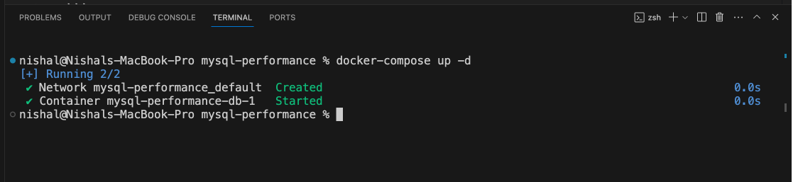
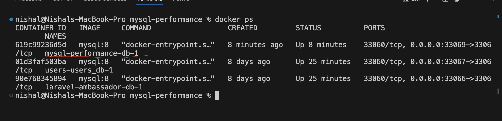
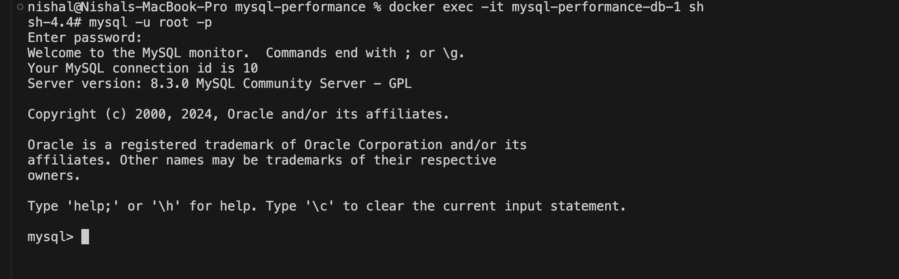
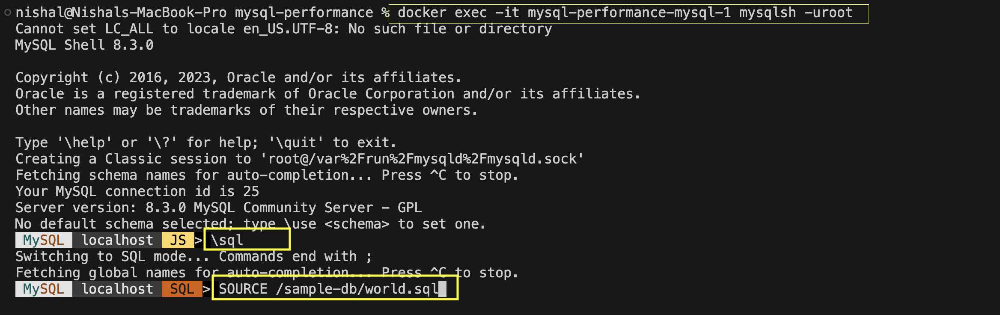

# Optimization in MySql

## Prerequisite

- Docker
- Mysql

## Installation

### 1. Install Docker

Please install Docker Desktop from the official [website.](https://www.docker.com/products/docker-desktop/)

### 2. Install Mysql

We'll install MySQL on the Docker. So please follow the following steps:

> Please make sure to open the Docker desktop.

1. Clone or download this project to your local machine via terminal.

```sh
git clone https://github.com/nishalgurung4/mysql-performance.git
```

> If you want to clone the project via ssh, use `git@github.com:nishalgurung4/mysql-performance.git`

2. Run mysql via docker

```sh
cd mysql-performance
docker-compose up -d
```



3. Let's execute a command in a running mysql container. For this, let's first identify the container name.

```sh
docker ps
```



```sh
docker exec -it <your_container_name> sh
```



> You can use following command to stop and remove the container

To stop the container:

```sh
docker stop <container_name>
```

To remove the container:

```sh
docker rm <container_name>
```

### Import sample db into mysql

We'll be using official sample databases provided by the MySQL team. Importing sample databases is required only once.

Let's copy sql dump to the container.

```sh
docker cp sample-db mysql-performance-db-1:/sample-db
```

Let's access mysql via mysql shell

```sh
docker exec -it <container_name> mysqlsh -uroot
```

Enter password `root`

Type following command to change the mode

```sh
\sql
```

We'll import the sample databases using following command

```sql
SOURCE /sample-db/world.sql
```

```sql
SOURCE /sample-db/sakila-schema.sql
```

```sql
SOURCE /sample-db/sakila-data.sql
```



### Some useful commands

- Press `ctrl` + `L` to clear the mysqlsh screen
- Type `\quit` to exit from the mysqlsh terminal
