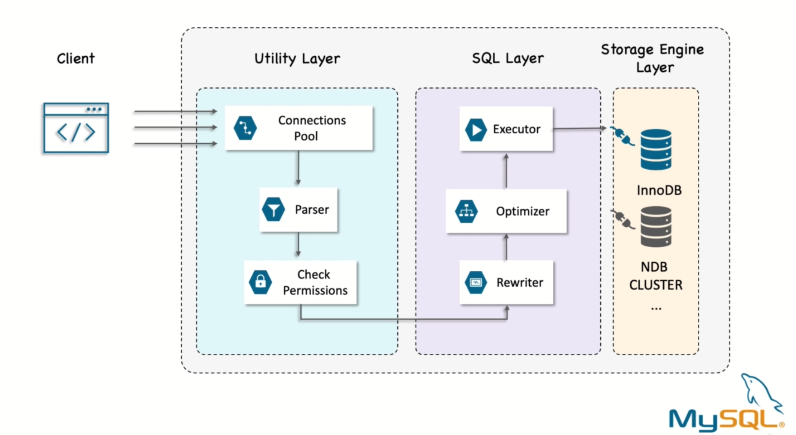
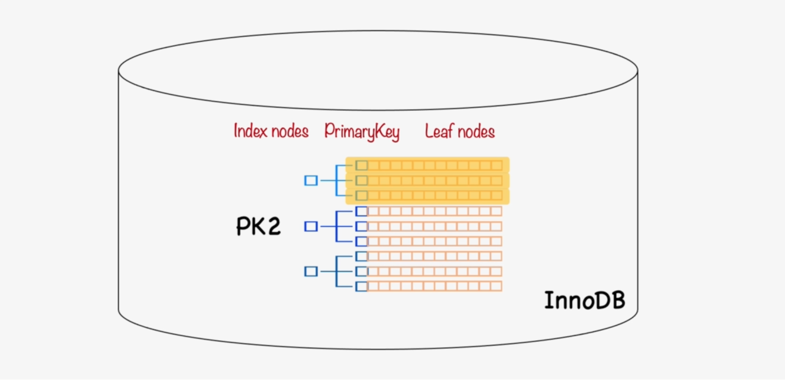
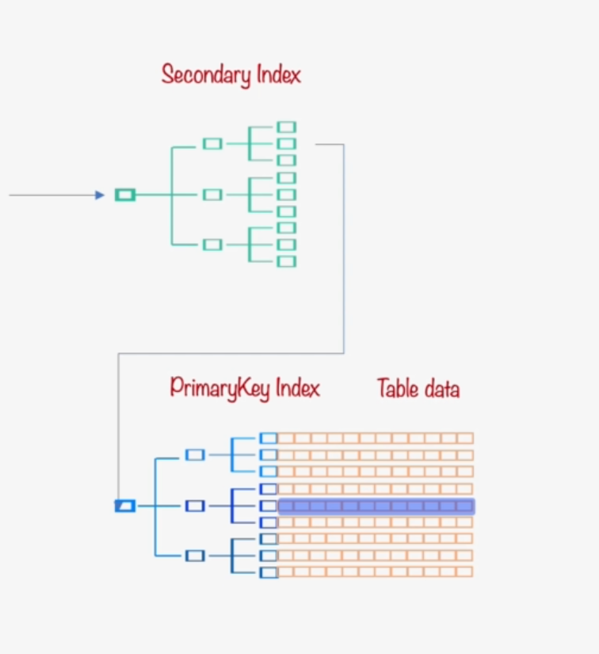

# Optimization

## Default databases in MySQL:

- mysql:
  It is the system database that contains tables that store information required by the MySQL server
- information_schema:
  It provides access to database metadata
- performance_schema:
  It is is a feature for monitoring MySQL Server execution at a low level
- sys:
  It is a set of objects that helps DBAs and developers interpret data collected by the Performance Schema

## Understanding performance schema

```sql
use performance_schema;
show tables;
```

- `events_statements_summary_by_diggest` table
  It is a report of all the queries that have been executed on the instance since the table was last reset. Normally the table reset when mysql restart.

```sql
SELECT
* FROM events_statements_summary_by_digest ORDER BY sum_timer_wait DESC limit 10 \G
```

Total time of query = SUM_TIMER_WAIT
`SUM_TIMER_WAIT` helps to identify the most expensive query

```sql
-- Each row shows the response time as a total and as a percent of the overall response time
-- This shows the top ten queries ordered by the total time consumed
SELECT (100 * SUM_TIMER_WAIT / sum(SUM_TIMER_WAIT) OVER ()) AS  percent, SUM_TIMER_WAIT AS total, COUNT_STAR AS calls, AVG_TIMER_WAIT AS mean, substring(DIGEST_TEXT, 1, 75) FROM performance_schema.events_statements_summary_by_digest ORDER BY SUM_TIMER_WAIT DESC LIMIT 10;
```

### Event summary columns

- `SUM_TIMER_WAIT`:
  The total wait time of the summarized timed events. This value is calculated only for timed events because nontimed events have a wait time of NULL.
- `MIN_TIMER_WAIT`:
  The minimum wait time of the summarized timed events.
- `AVG_TIMER_WAIT`:
  The average wait time of the summarized timed events.
- `MAX_TIMER_WAIT`:
  The maximum wait time of the summarized timed events.
- `SUM_ROWS_EXAMINED`:
- `SUM_ROWS_SENT`:
- `SUM_SELECT_FULL_JOIN`:
- `SUM_SELECT_RANGE_CHECK`:
- `SUM_CREATED_TMP_DISK_TABLES`:
- `SUM_SORT_MERGE_PASSES`:

## Why are queries slow?

Queries are tasks and they are composed of subtask, and those subtasks consume time to optimize a query. To optimize query, we must optimize each subtasks by eliminating them, making them happen fewer times, or making them happen more quickly.

Execution is one of the most important stage in the query lifetime. It involves a lot of calls to the storage engine to retrieve rows, as well as post retrieval operations, such as grouping and sorting. While accomplishing all these tasks, the query spends time on the network in the CPU in operations such as statistics and planning, locking, and most especially calls to the storage engine to retrieve rows. This calls consume time in memory, CPU and I/O if the data isn't in memory.

The goal of the optimization is to avoid that by eliminating or reducing operation or making them faster.

## Finding candidates queries for optimization:

Let's see some example:

```sql
SELECT * FROM performance_schema.events_statements_summary_by_digest
ORDER BY sum_timer_wait DESC LIMIT 3 \G
```

A large amount of `SUM_ROWS_EXAMINED` compared to the `SUM_ROWS_SENT` to the client suggest poor index usage since large number of rows are sent to the client, but discarded afterward.

If the `SUM_SELECT_FULL_JOIN` is high, this suggests that either an index is needed or there is a joint condition missing. A full table scan will occur when there is no index for the joint condition.

If the `SUM_SELECT_RANGE_CHECK` is high, this may suggest that we need to change the indexes on the tables. When a secondary index is used, but the range can include a large part of the table using a secondary index can end up more expensive than performing a full table scan.

If the `SUM_CREATED_TMP_DISK_TABLES` is high, this may suggest that we must consider which indexes are used for sorting and grouping and the amount of memory allowed to internal temporary table.

If the `SUM_SORT_MERGE_PASSES` is high, this may suggest that this query can benefit from a larger sort buffer.

```sql
-- to find the tables that uses full table scans
SELECT * FROM sys.schema_tables_with_full_table_scans;

-- to find the statements that uses full table scans
SELECT * FROM sys.statements_with_full_table_scans\G

SELECT * FROM sys.statements_with_full_table_scans ORDER BY no_index_used_count DESC \G
```

### Let's first check 2 default databases

We'll demonstrate table schema as well as indexes

```sql
DESCRIBE world.countrylanguate;
```

```sql
SHOW INDEXES FROM world.countrylanguage;
```

### Table I/O and File I/O for SELECTS:

The I/O performance is vital. Data is read and written to the disk in various places. Other than the table spaces and indexes, we have read logs, binary logs and so forth. An increase in IO count or latencies, it's neither a good or a bad thing on its own. However, if you identified a certain problem, for example, if you determined that the disk IO is a bottleneck as it is 100% utilized, then we can use the table IO and file IO views to determine what is the cause.

```sql
-- ignore
SELECT OBJECT_TYPE, OBJECT_SCHEMA, OBJECT_NAME, INDEX_NAME, COUNT_STAR
FROM performance_schema.table_io_waits_summary_by_index_usage WHERE OBJECT_SCHEMA = 'world'
AND OBJECT_NAME = 'city' \G

```

#### Table I/O and File I/O for INSERT, UPDATE, DELETE:

`COUNT_START` column shows the number of times the statement has been executed.

```sql
SELECT * FROM performance_schema.table_io_waits_summary_by_table WHERE
object_name = "city" AND object_schema = "world" \G

TRUNCATE table_io_waits_summary_by_table;

-- SELECT for index column
SELECT * FROM city WHERE CountryCode = "nld";

-- check table_io_waits_summary_by_table

-- SELECT for non index column
SELECT * FROM city WHERE name = "amsterdam";

-- Let's use update
UPDATE city SET name = "Amsterdam1" WHERE name = "Amsterdam";

-- check table_io_waits_summary_by_table, more than 4K are read and fetch even though this is an update query

```

> Update and DELETE statement also reads even though they are writes statement. The reason is that the rows must be located before they can be changed.

### Checking error summary table

While errors are not directly related to query tuning but the error will still be using resources. So, indirectly, errors affect the query performacne by adding unnecessary load to the system.

There are also errors that are more directly related to the performance, such as errors posed by failure to obtain logs one down and multiple concurrent requests that need to change a resource. For example, a row must be locked while being changed by one request in order to avoid data inconsistencies. If that request takes too long to be processed, this will impact all other requests that are waiting for their turn.

There are 5 tables in performance_schema grouping the errors encountered by different classifications.

- events_errors_summary_by_account_by_error
- events_errors_summary_by_host_by_error
- events_errors_summary_by_thread_by_error
- events_errors_summary_by_user_by_error
- events_errors_summary_global_by_error

```sql
SELECT * FROM performance_schema.events_errors_summary_by_account_by_error
WHERE error_name = "er_lock_deadlock"\G
```

## `EXPLAIN` for Query Optimization



`EXPLAIN` statement provides information about the query plan chosen by the query optimizer.
The optimizer has to make a few decisions before executing each query.

For example, what is cheaper from a response time perspective? Fetch the data directly from a table or go to an index and stop here, because all the columns required by the client are in the index or get to the location of the records from the index and go to the table to get the actual data.

The first method fetching data directly from the table is called `full scan`. This is normally the most expensive because all the rows must be fetched from the table and checked against the condition. Yet this method work best for the small table.

In the second setup option, it access the index. If the index has all the necessary data and there is no need to access the table. This is called a `covering index`. This is less often a case. So the index is used to filter out rows and then access those rows fromt the table. Usually this is the cheapest way to access a table. Still, if the client selects a large number of rows, this may not be valid anymore.

Therefore, the optimizer has to make a lot of decisions based on particular database statistics before executing a query.

In summary:

1. Use sequential scan
2. Use index
   2.1 Covering Index
   2.2 Get data adress

```sql
EXPLAIN SELECT * FROM actor where first_name = "NICK" \G

-- GET both the estimation of what the planner expect and what actually happen
-- using EXPLAIN and ANALYZE
EXPLAIN ANALYZE SELECT * FROM actor where first_name = "NICK" \G

EXPLAIN FORMAT=json SELECT * FROM actor where first_name = "NICK" \G

EXPLAIN FORMAT=tree SELECT * FROM actor where first_name = "NICK" \G
```

> It is difficult to use EXPLAIN for insert, update and delete. It is because the underlying data will change hile executing the queries.

```sql
SHOW columns from actor;
```

##### Example

1. Let's select with a condition on a non indexed column

As there is no index, it will require a full table scan.

```sql
EXPLAIN ANALYZE SELECT * FROM city WHERE name = "London" \G
```

`type = ALL` shows that it scans all the rows in the table. It is estimated that `rows: 4046`, 4046 rows will be examined and for each row a where clause will be applied. `filtered: 10`, 10% of the rows examined will match the where clause.

Here the traditional format is easier to use to see the indexes used and other basic information about the query plan while the json format provides much more detail. The tree format focuses on describing how the query is executed in terms of the relationship between
the parts of the query and also the order in which these parts are executed.

```sql
EXPLAIN format=tree SELECT * FROM city where name = "LONDON";
```

Here, explain output is organized into a series of nodes. At the lowest level, they are nodes that scan tables or search indexes. Higher level nodes take the results from the lower level nodes and operate on them.

> The estimation cost is represented in some internal MySQL units.

2. Let's select with a condition on a indexed column

```sql
EXPLAIN ANALYZE SELECT * FROM city where countrycode = 'FRA';
```

3. Let's select which has a primary key with two columns

```sql
SHOW columns from countrylanguage;

EXPLAIN ANALYZE SELECT * FROM countrylanguage WHERE CountryCode = 'CHN';
```

4. Two tables with subquery and sorting

```sql
EXPLAIN ANALYZE
    SELECT ci.ID, ci.Name, ci.District, co.Name AS Country, ci.Population
    FROM world.city ci
        INNER JOIN
            (SELECT Code, Name FROM world.country
            WHERE Continent = "Europe"
            ORDER BY SurfaceArea LIMIT 10) co ON co.Code = ci.CountryCode
        ORDER BY ci.Population DESC
        LIMIT 5\G;
```

> If the estimated cost and actual cost has big difference, though the optimizer will make poor decisions. Possible causes for this difference could be that either the optimizer doesn't have upto date statistics. Or the optimizer estimates are off for some reason.

Let's see an example:

```sql
USE adbms;

CREATE TABLE test_estimates (id INT AUTO_INCREMENT PRIMARY KEY, val INT, val2 INT);

ALTER TABLE test_estimates ADD INDEX idx(val);
```

Now load data using python script:

```python
queries = [
("INSERT INTO `test_estimates` (`val`, `val2`) VALUES (?, ?)",)
]
for x in range(0, 1000000):
    for query in queries:
        sql = query[0]
        result = session.run_sql(sql, (x,x,))
```

Now let's analyze the query

```sql
EXPLAIN ANALYZE SELECT * FROM test_estimates WHERE 2 * val < 3;
```

In this case we can see that it estimate rows=100256 but the actual value is different. This is because it has statistics on column not on expression. It scan the whole table for the estimation. Avoiding it is a best choice or we can also add index for the expression to fix the statistics

```sql
ALTER TABLE test_estimates ADD INDEX idx_fun((2 * val));
```

In conclusion, `EXPLAIN ANALYZE` do following:

- reveal where time is spent and why?
- display the difference between planning vs actual execution

#### Indexing

```sql
ALTER TABLE <table_name> ADD INDEX idx(<col>);

SHOW INDEXES FROM <table_name> \G;

DROP INDEX name_idx ON `table_name`
```



MySQL uses an index to organize the data in the tables. The index is called the clusterings index and the name comes from the fact that the index values are clustering together. Notice that the leaf pages contain full rows, but the note pages contain only the index columns. By default INNODB use the primary key for the cluster index.

##### How to choose the primary key

Everything in mysql is an index. InnoDB, which is the main storage engine of MySQL uses an index to organize the data in the tables. This index is based on the primary key. When we work with table, index organize table as the one in mysql. So, the choice of the primary index is very important.

The primary key can impact the ratio between random and sequential I/O, the size of secondary indexes and how many pages need to be read into the buffer pool.

The primary key for INNODB tables is always a B-tree index. It uses an index to organize the data in the tables. The index is called `clustered index`. The index values are clustered together. The leaf pages contain full rows but the node pages contain only the indexed columns. By default INNODB uses the primary key for the clustered index. If you don't define the primary key, INNODB will try to use a unique non-nullable index instead and if there is no such index, innodb will define a hidden primary key for you and clustered based on that.

However, there are 2 major drawbacks of hidden primary key:

- It only identifies the row for the local MySQL instance
- and the counter is global to all INNODB table in the current DB instance.

MySQL store data in the fixed size pages. This is because keeping related data together, it can fetch more data by reading less pages. For example, when implementing a mailbox, you can cluster by user_id. So you can retrieve all messages of a single user by fetching only a few pages from the disk. If it didn't use clustering, each message might require its own disk IO. Keeping the data closely together will also make data access faster for joins and for lookups when using the primary key. A clustered index holds both the index and the data together in one B-tree. So retrieving the rows from it is notrmally faster than a comparable lookup in unknown clustered index.

But as a downside, if the tables are not designed to take advantage of the clustered indexes properties, some drawbacks can appear. For instance, when new rows are inserted or when the primary key is updated, tables built up clustered index are subject to page split. A page split happens when a row value dictates that the row must be placed into a page that is full of data. So the storage engine must split the page into 2 to accommodate the new row. This kind of page split cann cause a table to use more space on disk than necessary.

Similarly, the speed of insert depends heavily on insertion order. Inserting rows in primary key order is the fastest way to load data into INNODB table.

If you didn't load the rows in the primary keys order, then it might be a good idea to reorganize the table with following:

```sql
-- To check table engine
SHOW TABLE STATUS WHERE Name = "test_estimates";
-- remove table fragmentation
OPTIMIZE TABLE test_estimates;
```

- How to insert rows in primary key order?
  To achieve it, by defining a surrogate key, which is a primary key, whose values are not dervied from your application data. The easiest way is to do this is usually use auto increment column. This will ensure that the rows are inserted in sequential order and will offer better performance for join using the primary key. It is best to avoid random or non sequential clustering keys, especially for IO bounds workload. For example, using UUID values is a poor choice from a performance standpoint because it makes clustered index insertion random, which is the worst case scenario and doesn't give you any helpful data clustering.

### Example:

```sql
--create table with primary key auto increment
CREATE TABLE users (
  id    int unsigned NOT NULL AUTO_INCREMENT,
  name  varchar(64) NOT NULL DEFAULT '',
  email varchar(64) NOT NULL DEFAULT '',
  dob   date DEFAULT NULL,
  PRIMARY KEY (id),
  UNIQUE KEY email (email)
) ENGINE=InnoDB;
-- create table with uuid
CREATE TABLE users_uuid (
  uuid  varchar(36) NOT NULL,
  name  varchar(64) NOT NULL DEFAULT '',
  email varchar(64) NOT NULL DEFAULT '',
  dob   date DEFAULT NULL,
  PRIMARY KEY (uuid),
  UNIQUE KEY email (email)
) ENGINE=InnoDB;
```

Use python script to insert:

```python
import time
queries = [
    ("INSERT INTO `users` (`name`, `email`, `dob`) VALUES (?, ?, ?)", ["John Doe", "john@gmail.com", "1991-02-01"])
]
start_time = time.time()
for x in range(0, 100000):
  for query in queries:
    sql = query[0]
    param = query[1]
    result = session.run_sql(sql, (param[0], param[1] + str(x), param[2],))
print("--- %s seconds ---" % (time.time() - start_time))
```

```python
import time, uuid
queries = [
    ("INSERT INTO `users_uuid` (`uuid`,`name`, `email`, `dob`) VALUES (?,?, ?, ?)", ["John Doe", "john@gmail.com", "1991-02-01"])
]
start_time = time.time()
for x in range(0, 100000):
  for query in queries:
    sql = query[0]
    param = query[1]
    result = session.run_sql(sql, (str(uuid.uuid4()), param[0], param[1] + str(x), param[2],))
print("--- %s seconds ---" % (time.time() - start_time))
```

Now measure the time and you will find that the time taken for the uuid is more than that of auto_increment. Also the resulting indexes are a bit larger

```sql
SELECT TABLE_NAME AS `table`,
ROUND((DATA_LENGTH + INDEX_LENGTH) / 1024 / 1024) AS `SIZE (MB)`
FROM information_schema.TABLES
WHERE
TABLE_SCHEMA = "adbms"
ORDER BY
(DATA_LENGTH + INDEX_LENGTH)
DESC;
```

To see why it is like this. Let's quickly check what happens in the index when we insert data into the first table with auto_increment.

Here inserts are filling up a page and then continuing on the second page. INNODB stores each record immediately after the one before, because the primary key values are sequential. When the page reaches its maximum fill factor, which by default is 15 out of 16. The next record goes to next page. It is only 15 to leave room for later modifications.

Constrast to this, when we insert the data into the second table with uuid, The one with uuid clustered index because each new record doesn't necessarily have a larger primary key value than the previous one. INNODB cannot always place the row at the end of the last index but it has to find the appropriate place for the row. This causes a lot of extra work and results in a suboptimal data layout.

##### Why add a secondary Index?

Secondary index are all keys that are not primary key and that may also have duplicate value.

Any secondary index access requires 2 index lookup instead of 1. Why?



As an example consider this query:

```sql
SELECT username FROM userinfo WHERE email = 'john@doe.com';
```

Imagine that we have a secondary index on the email column. In this case, to access the username, MySQL first search in the secondary index to find which is the primary key for the given email. Then with the primary key, the storage engine navigates the primary index and searches for the actual row which has the value we are looking for. Note: the leaf node in the secondary index doesn't store a pointer to the reference row physical loaction rather it stores the primary key value. Therefore, choosing a large primary key will also have an impact on the size of every other index.

The main purposes are:

1. Reduce the rows examined
2. Sort data
3. Validate data
4. Avoid reading rows
5. Find Min/Max values

- Inaction for 1 & 2:
  No index, it do full scan.

```sql
EXPLAIN ANALYZE SELECT * FROM sakila.payment WHERE amount = '10.99';

-- let's return most expensive payment
EXPLAIN ANALYZE SELECT * FROM sakila.payment ORDER BY amount DESC limit 10;
```

Now let's add index

```sql
ALTER TABLE sakila.payment ADD INDEX idx_amt(amount);
```

- Inaction for 3 (Validation):

```sql
CREATE UNIQUE INDEX index_name ON table_name (col_1, col_2,....);

```

- Inaction for 5:

For the `GROUP BY` value, the minimum and maximum values for an index column can be found by just checking the first and last records in the index.

```sql
EXPLAIN ANALYZE SELECT customer_id, max(amount) FROM sakila.payment GROUP BY customer_id LIMIT 10;
```

> Index maintenance is a never ending task. Indexes may affect not only the raw query performance but also locking memory and CPU

We can use following performance and sys schema to check the indexes that are not use any more or not used at all

```sql
SELECT * FROM sys.schema_unused_indexes\G

SELECT * FROM sys.schema_redundant_indexes\G
```

When MySQL decides whether to use an index or not, it boils down to how effective MySQL thinks the index is for the query. Remember that when we use a secondary index, there will be an extra primary key lookup to get the data. Also, secondary indexes are not ordered in the same way as the rows. So using an index in general means random I/O. A table scan on the other hand is to a larger degree sequential I/O, so row for row doing a table scan is cheaper than finding the same row using a secondary index. This means that the index to be effective, it must filter out a large part of the table.

##### How to help MySQL make better decisions:

The optimizer, which is the part of MySQL, decides which query plan to use. It needs some simple way to determine how good an index is for the given query plan. The optimizer obviously knows which columns the index include. But additionally, it needs some measure of how well the index filters the rows. This kind of fact are found in index statistics, which provides approximate information about the distribution of data in an index. In MySQL, Storage engine is responsible for providing the index statistics.

InnoDB calculates its index statistics by analyzing random leaf pages of the index. It may be, for example, 20 random index pages are sampled, which is also called 20 index dives and it is examined which index values those pages consist of. Then InnoDB scales this based on the total size of the index. An important implication of this is that InnoDB index statistics are not exact.

Why estimate statistics are used instead of exact statistics?

- The reason is performance. Calculating the index statistics has a adverse effect on query performance. So, it has been chosen to limit the scans to a relatively small number of pages.

The downside of using approximate statistics is that they are not always a greater representation of the actual distribution of value. When this happens, the optimizer may choose the wrong index or the wrong join order causing slower query than necessary.

However, it is also possible to adjust the number of random index dives. It depends on whether `persistent` or `transient` statistics are used. Persistent statistics are in general preferred as they gie more consistent query plans, allow to sample more pages. They are updated in the background and they can be configured to a larger degree including support for table level options.

```sql
SHOW VARIABLES LIKE 'innodb_stats_persistent_sample_pages';

SHOW VARIABLES LIKE 'innodb_stats_transient_sample_pages';
```

These two are global variables. To override, it is recommended to configure them for individual tables.

```sql
CREATE TABLE `table_1` (
  `id` int NOT NULL AUTO_INCREMENT,
  `date` datetime,
  PRIMARY KEY (`id`),
  INDEX `DATE_IX` (`date`)
) ENGINE = InnoDB,
STATS_SAMPLE_PAGES = 25;

-- or

ALTER TABLE `table_1` STATS_SAMPLE_PAGES = 25;
```

If the data distribution is uniform, that is roughly the same number of rows per index value, then only a relatively small number of pages need to be examined and the default number of pages is enough.

On the other hand, if you have data that has a very irregular distribution, you may need to increase the number of pages sampled.

The table size is also another factor. The larger the table, the more pages must be examined to get a good estimate.

But it is necessary to know that the more pages, the more accurate statistics, but also the higher the cost. The cost appears when analyzed table is executed. This command is normally executed automatically when more than 10% of rows have been changed. And its job is to updated index statistics so you can consider decreasing the number of sample pages.

##### Composite Index

Also known as multi column index. The common mistakes of composite indexes are:

1. Index columns separatly
2. Index columns in the wrong order

In the following case, it is better to combine multiple columns in a single index. When we use another index on the population column to look for cities with a population greater than 1 million. However, if we make queries using multiple filtering conditions, then individual indexes on lots of columns won't help increase MySQL performance. MySQL can cope a little with such poorly index table by using a strategy knwon as index merge which allows a query to make a limited use of multiple indexes. Therefore, for this case, it is best to combine it into one index that includes both columns.
Here CountryCode uses Equal reference and Population uses Range search.
In mysql if the column is used for the range search or sorting no more column can be use in the index so we need to create a index in following order

```sql
SELECT ID,Name,District,Population FROM world.city WHERE CountryCode = 'DEU' AND Population > 10000000;

-- To add index
ALTER TABLE world.city ADD INDEX(CountryCode, Population);

```

Similarly, if there are multiple columns with equal reference, in this case we need to identify following:

- Which columns are most often used?
  In this case, if we create an index as:

```sql
CREATE INDEX idx ON table_1 (col_a, col_b, col_c);

-- this will use the index
SELECT * FROM table_1 WHERE col_a = 'val1' AND col_b = 'val2'

-- this won't work because col_b needs to come with col_a
SELECT * FROM table_1 WHERE col_b = 'val2';

-- this will use
SELECT * FROM table_1 WHERE col_a = "val1";
-- it will work if we create INDEX (col_b, col_c)
```

- How well does the column filter the data?
  Normally, we should add more selective column first. The more distinct value the column is the more selective a column is.

Let's compare the composite and individual indexes

```sql
-- we want to query following
SELECT count(*) FROM users WHERE name = 'John' AND dob = "1992-01-01";
```

```python
import time
query = ("SELECT count(*) FROM users WHERE `name` = ? AND `dob` = ?", ['John Doe', "1992-01-01"])
nb_of_requests = 300
start_time = time.time()
for x in range(0, nb_of_requests):
  sql = query[0]
  param = query[1]
  result = session.run_sql(sql, (param[0], param[1],))
total_time = time.time() - start_time
qps = nb_of_requests / total_time
print("- Total time: %s seconds -" % total_time)
print("--- %s QPS ---" % qps)
```

```sql
ANALYZE table users;
```

Now, let's add individual index

```sql
ALTER TABLE users ADD INDEX name_idx(name);

ALTER TABLE users ADD INDEX dob_id_idx(dob);
```

Execute python scirpt to check QPS.

Now, let's add composite index

```sql
DROP INDEX name_idx on users;
DROP INDEX dob_id_idx on users;

ALTER TABLE users ADD INDEX name_dob_id_idx(name, dob);
```

##### Redundant Indexes

In most cases, we don't really want redundant indexes. To avoid them, we should extend already existing indexes. But there are some cases, where we need redundant indexes for the performance issue for eg: extending an existing index might make it much larger and reduce performance of some kind of queries. Redundant indexes are a bit different from duplicate indexes.

```sql
CREATE INDEX idx ON table_1 (col_a, col_b);

CREATE INDEX idx ON table_1 (col_a); -- this is redundant
CREATE INDEX idx ON table_1 (col_b, col_a); -- not redundant
CREATE INDEX idx ON table_1 (col_b); -- not redundant
```

Also hash indexes, full-text indexes are not redundant indexes.

- Q1. SELECT count(\*) FROM users WHERE state_id = 5;
- Q2. SELECT name, email, dob FROM users WHERE dob = "1992-01-01";

> Inserting rows in having multiple indexes is slower

#### Time for practice:

Let's benchmark:

```sql
-- lets remove secondary index first
DROP INDEX name_db_id_idx on users;
--Q1
SELECT count(*) FROM users WHERE dob = "1992-01-02";
-- Q2
SELECT name, email, dob FROM users WHERE dob = "1992-01-02";
```

In above case let's benchmark both Questions with

- No index
- idx(dob)
- idx(name,email,dob)
- Both idxs

| QPS | No Index | Idx(dob) | idx(name, email, dob) | Both idx |
| --- | -------- | -------- | --------------------- | -------- |
| Q1  |          |          |                       |          |
| Q2  |          |          |                       |          |

When keeping both idxs, there would be maintenance cost.

You can also benchmark the test to identify that Insert rows performance will be decrease on using multiple indexes.

#### Try to avoid expression in database level

#### MySQL configuration best practices:

Here are the recommendation for best practices:

- Use monitoring to verify the effect.
- Change one option at a time.
- Make relatively small incremental changes.
- Consider the side effects.

Process:

- Define the problem
- Collect baseline either through monitoring system or by timing the query
- Define the goal of optimization
- Determine cause
- Determine solution
- Implement solution
- Verify effect

###### InnoDB Overview:

- Buffer Pool
- Log Buffer
- Tablespaces
- Redo Logs
- Doublewrite buffer

Important configuration for Buffer pool:

- innodb_buffer_pool_size
- innodb_buffer_pool_instances
- innodb_buffer_pool_dump_pct
- innodb_old_blocks_time
- innodb_old_blocks_pct
- innodb_io_capacity
- innodb_io_capacity_max
- innodb_flush_method

```sql
SHOW GLOBAL VARIABLES like 'innodb_buffer_pool_size';


SELECT Variable_name, Variable_value FROM sys.metrics
WHERE Variable_name IN ('Innodb_pages_read', 'Innodb_buffer_pool_read_requests')\G
```

Hit rate = 100 - (100 \* Innodb_pages_read / Innodb_buffer_pool_read_requests)

We should aim at having hit rate to 100%

- Important configuration for Redo Log

* innodb_log_buffer_size
* innodb_log_file_size
* innodb_log_files_in_group

#### MySQL Transactions and Locks

Transactions are very important to ensure data integrity. But when use strongly, they can cause severe performance issues. A transaction is a group of SQL queries that are treated automically as a single unit of work. If the database engine can apply the entire group of queries, it does so but if any of them can be done because of any reason, none of them is applied.

Since transactions must provide automicity they must acquire locks. And the longer a transaction is active, the longer resources associated with the queries are held occupied. The two main resouces are logs and undo logs.

A database server with ACID transactions generally requires more CPU power, memory and disk space.

> Index helps to reduce locking

- How to monitor transactions?

```sql
SELECT * FROM information_schema.innodb_trx\G

SELECT * FROM information_schema.innodb_trx WHERE trx_started < now() - interavl 1 minute ORDER BY trx_rows_locked DESC
```

- OLAP (Onine Analytical Process)
- OLTP (Online Transaction Processing)

* How to monitor locks

```sql
SELECT * FROM information_schema.data_lock_waits\G
```

#### Scaling MySQL

##### Sharding
